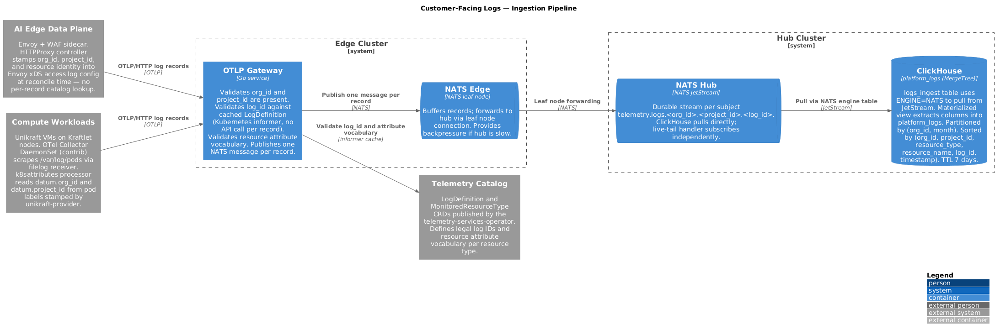
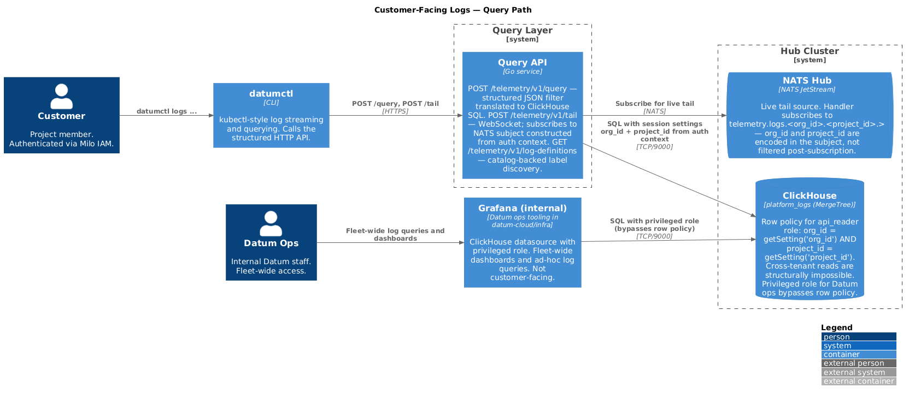

# Customer-Facing Logs

Status: Draft
Scope (v1): AI Edge (HTTPProxy + WAF) logs and Compute workload stdout/stderr

## Motivation

Datum platform services emit operational signals — request logs, security
events, control-plane activity — that customers need visibility into for
debugging, compliance, and security investigation. Today there is no
customer-facing query surface for these logs. Customers running workloads on
AI Edge (Datum's HTTP proxy + WAF product) cannot answer basic questions
like "show me 5xx responses for my proxy in the last hour" or "which
requests did the WAF block." Customers running compute workloads have no
visibility into their workload output.

This design defines a project-scoped, multi-tenant logs pipeline with a
structured HTTP query API backed by ClickHouse SQL. AI Edge and Compute are
the v1 scope: AI Edge
produces high-volume access logs and WAF events that are the most acute
customer need; Compute produces workload stdout/stderr, which is the minimum
viable debugging surface for compute customers.

## Goals (v1)

- Customers can query AI Edge access logs, WAF events, and Compute workload
  output for their project through `datumctl`.
- All logs are tenant-isolated at storage and query time; cross-tenant
  reads are structurally impossible.
- Each log event is stored exactly once. There is no duplication of records
  across partitions.
- Log schemas are declared once by the producing service and surface
  automatically as catalog metadata (resource types, label vocabulary, log
  definitions).
- 7-day default retention for operational logs. Retention is platform-set
  in v1; not user-controllable.

## Non-Goals (v1)

- Control-plane audit logs. Audit logs are collected by the activity
  system (`milo-os/activity`) and stored separately; they do not flow
  through this pipeline.
- Customer-configurable log export — deferred to a follow-on enhancement.
  The NATS subject structure is designed to enable this without schema
  changes when the time comes.
- Body-content redaction via regex; v1 redacts at attribute level only.
- Log-based metrics and alerting derived from log streams.
- Per-project ingestion quota. Volume protection in v1 is platform-set
  defaults at the gateway; a `LogIngestionQuota` resource is a follow-on
  enhancement.
- Structured OTLP export from within compute workloads (custom spans,
  metrics). v1 covers stdout/stderr only; structured OTLP from workload
  code requires a sidecar or per-workload endpoint and is a follow-on.

## Layers

### 1. Service Declaration

Services declare what they emit in their `ServiceConfiguration`
(`services.miloapis.com/v1alpha1`). Two fields participate:

- `spec.monitoredResourceTypes[]` — already fans out to
  `billing.MonitoredResourceType`; now also fans out to a new
  `telemetry.MonitoredResourceType`.
- `spec.logs[]` (new) — fans out to `telemetry.LogDefinition`.

Each log event produces exactly one row — there is no duplication of records
across partitions. `org_id` and `project_id` are stamped by
platform-controlled producers at config time; the row policy enforces tenant
isolation at read time.

AI Edge declaration:

```yaml
apiVersion: services.miloapis.com/v1alpha1
kind: ServiceConfiguration
metadata:
  name: networking-datumapis-com
spec:
  serviceRef:
    name: networking-datumapis-com
  phase: Published
  monitoredResourceTypes:
    - resourceTypeName: networking.datumapis.com/HTTPProxy
      displayName: HTTP Proxy
      gvk:
        group: networking.datumapis.com
        kind: HTTPProxy
      labels:
        - name: resource.group
          description: API group of the resource (networking.datumapis.com).
        - name: resource.kind
          description: Resource kind (HTTPProxy).
        - name: resource.name
          description: Name of the HTTPProxy instance.
        - name: resource.namespace
          description: Project namespace the HTTPProxy belongs to.
        - name: hostname
          description: Hostname the request was received on.
  logs:
    - logID: networking.datumapis.com/httpproxy-access
      displayName: HTTP Proxy Access Log
      description: One entry per HTTP request handled by the proxy.
      monitoredResourceType: networking.datumapis.com/HTTPProxy

      entrySchema:
        - name: http.request.id
          description: Per-request correlation ID (Envoy x-request-id).
        - name: http.request.method
          description: HTTP method (GET, POST, etc).
        - name: http.response.status_code
          description: HTTP response status returned to the client.
        - name: url.path
          description: Request path.
        - name: client.address
          description: Client IP.
        - name: user_agent.original
          description: Verbatim User-Agent header sent by the client.
        - name: http.request.duration_ms
          description: Request duration in milliseconds.
        - name: edge.pop.ingress
          description: PoP code that received the request (e.g. cdg1).
        - name: edge.pop.upstream
          description: PoP that routed to the upstream when different from ingress; empty when handled at ingress.
        - name: waf.outcome
          description: Summary of WAF decision for this request — allowed, blocked, or challenged.
        - name: waf.matched_rules
          description: Number of WAF rules that matched on this request. Non-zero implies a paired httpproxy-waf entry exists per matched rule.
      categoryGroups: [allLogs]

    - logID: networking.datumapis.com/httpproxy-waf
      displayName: HTTP Proxy WAF Event Log
      description: One entry per WAF rule evaluation that matched or blocked.
      monitoredResourceType: networking.datumapis.com/HTTPProxy

      entrySchema:
        - name: http.request.id
          description: Matches the http.request.id on the paired httpproxy-access entry.
        - name: waf.rule.id
          description: Identifier of the WAF rule that matched.
        - name: waf.action
          description: Action taken for this rule — block, log, challenge.
        - name: waf.severity
          description: Severity classification of the matched rule.
      categoryGroups: [allLogs]
```

Compute declaration:

```yaml
apiVersion: services.miloapis.com/v1alpha1
kind: ServiceConfiguration
metadata:
  name: compute-datumapis-com
spec:
  serviceRef:
    name: compute-datumapis-com
  phase: Published
  monitoredResourceTypes:
    - resourceTypeName: compute.datumapis.com/Workload
      displayName: Compute Workload
      gvk:
        group: compute.datumapis.com
        kind: Workload
      labels:
        - name: resource.group
          description: API group of the resource (compute.datumapis.com).
        - name: resource.kind
          description: Resource kind (Workload).
        - name: resource.name
          description: Name of the Workload.
        - name: resource.namespace
          description: Project namespace the Workload belongs to.
  logs:
    - logID: compute.datumapis.com/workload-stdout
      displayName: Workload Output
      description: Stdout and stderr from workload containers.
      monitoredResourceType: compute.datumapis.com/Workload

      entrySchema:
        - name: stream
          description: Output stream — stdout or stderr.
        - name: container.name
          description: Container name within the workload.
      categoryGroups: [allLogs]
```

### 2. Platform Catalog

The telemetry operator (`milo-os/telemetry`) owns two new CRDs that the
`ServiceConfiguration` controller fans out into.

`telemetry.MonitoredResourceType` — instance-identifying label vocabulary
for a resource Kind. Parallel to `billing.MonitoredResourceType`:

```yaml
apiVersion: telemetry.miloapis.com/v1alpha1
kind: MonitoredResourceType
metadata:
  name: networking-datumapis-com-httpproxy
spec:
  resourceTypeName: networking.datumapis.com/HTTPProxy
  phase: Published
  displayName: HTTP Proxy
  gvk:
    group: networking.datumapis.com
    kind: HTTPProxy
  labels:
    - name: resource.group
    - name: resource.kind
    - name: resource.name
    - name: resource.namespace
    - name: hostname
```

`LogDefinition` — the log type catalog entry; references
`MonitoredResourceType` by `resourceTypeName`:

```yaml
apiVersion: telemetry.miloapis.com/v1alpha1
kind: LogDefinition
metadata:
  name: networking-datumapis-com-httpproxy-access
spec:
  logID: networking.datumapis.com/httpproxy-access
  phase: Published
  displayName: HTTP Proxy Access Log
  monitoredResourceType: networking.datumapis.com/HTTPProxy

  entrySchema:
    - name: http.request.id
    - name: http.request.method
    - name: http.response.status_code
    - name: url.path
    - name: client.address
    - name: user_agent.original
    - name: http.request.duration_ms
    - name: edge.pop.ingress
    - name: edge.pop.upstream
    - name: waf.outcome
    - name: waf.matched_rules
  categoryGroups: [allLogs]
```

Both CRDs are server-managed: the `ServiceConfiguration` controller is the
sole writer. Customers read them via standard list/get to populate UIs and
discover available log types.

### 3. Ingestion Pipeline



Log records enter the pipeline from two sources with different trust models.
In both cases, `org_id` and `project_id` are resolved by the platform at
configuration time — not per-record at the gateway. The gateway receives
them pre-stamped and trusts them because the stamping components are
platform-controlled.

#### 3a. AI Edge (Envoy)

The HTTPProxy controller generates Envoy xDS configuration for each
`HTTPProxy` resource. At reconcile time, the controller knows the HTTPProxy's
namespace (= `project_id`) and the project's parent organization (= `org_id`).
It stamps both into the OTel access log resource attributes:

```yaml
# Generated by HTTPProxy controller into Envoy xDS
access_log:
  - name: envoy.access_loggers.open_telemetry
    typed_config:
      "@type": type.googleapis.com/envoy.extensions.access_loggers.open_telemetry.v3.OpenTelemetryAccessLogConfig
      common_config:
        grpc_service:
          envoy_grpc: {cluster_name: telemetry_gateway}
        log_name: networking.datumapis.com/httpproxy-access
      resource_attributes:
        values:
          - key: org_id
            value: {string_value: "org-abc123"}       # resolved at reconcile time
          - key: project_id
            value: {string_value: "proj-xyz456"}      # = HTTPProxy's namespace
          - key: resource.group
            value: {string_value: "networking.datumapis.com"}
          - key: resource.kind
            value: {string_value: "HTTPProxy"}
          - key: resource.name
            value: {string_value: "my-proxy"}         # = HTTPProxy.metadata.name
          - key: resource.namespace
            value: {string_value: "proj-xyz456"}
      attributes:
        values:
          - key: http.request.id
            value: {string_value: "%REQ(x-request-id)%"}
          - key: http.request.method
            value: {string_value: "%REQ(:method)%"}
          - key: http.response.status_code
            value: {string_value: "%RESPONSE_CODE%"}
          - key: url.path
            value: {string_value: "%REQ(x-forwarded-proto)%://%REQ(:authority)%%REQ(:path)%"}
          - key: client.address
            value: {string_value: "%DOWNSTREAM_REMOTE_ADDRESS_WITHOUT_PORT%"}
          - key: user_agent.original
            value: {string_value: "%REQ(user-agent)%"}
          - key: http.request.duration_ms
            value: {string_value: "%DURATION%"}
          - key: waf.outcome
            value: {string_value: "%FILTER_STATE(waf.outcome)%"}
          - key: waf.matched_rules
            value: {string_value: "%FILTER_STATE(waf.matched_rules)%"}
```

Envoy is a platform-controlled producer — Datum generates its configuration,
not the customer. The gateway therefore trusts the `org_id` and `project_id`
values it receives from Envoy without further catalog lookup.

#### 3b. Compute (Workload stdout/stderr)

Compute workload containers run on Kraftlet nodes managed by the
unikraft-provider. The container runtime writes stdout/stderr to files on the
node at:

```
/var/log/pods/<namespace>_<pod>_<uid>/<container>/0.log
```

An OTel Collector DaemonSet (contrib distribution) deployed to each Kraftlet
node scrapes these files using the `filelog` receiver, which handles the CRI-O
log format natively. The `k8sattributes` processor enriches each log line with
metadata from the pod's labels:

- `org_id` — from pod label `datum.org_id`
- `project_id` — from pod label `datum.project_id`
- `resource.name` — from pod label `compute.datumapis.com/workload-name`
- `resource.namespace` — from pod label `compute.datumapis.com/workload-deployment-name` (or namespace)
- `container.name` — from the log file path
- `stream` — `stdout` or `stderr`

The unikraft-provider stamps `datum.org_id` and `datum.project_id` on every
Pod it creates, sourcing the values from the parent Instance's labels, which
the compute controller stamps from the Workload's namespace (= `project_id`)
and the namespace's owning organization (= `org_id`):

```go
// In unikraft-provider instance controller, when building the Pod spec:
pod.Labels["datum.org_id"]    = instance.Labels["datum.org_id"]
pod.Labels["datum.project_id"] = instance.Labels["datum.project_id"]
```

The OTel Collector DaemonSet exports records as OTLP to the gateway with
`log_id` set to `compute.datumapis.com/workload-stdout`. The gateway treats it
as a platform-controlled producer; the pod label values are trusted. Using
the contrib collector for this DaemonSet is consistent with the collectors
already running in the edge and hub clusters — same image, same config
patterns.

#### 3c. Gateway Responsibilities

The gateway is the OTLP bridge — a thin Go service that accepts OTLP/HTTP,
applies schema validation, and writes to NATS. It is not responsible for
resolving tenant identity; that is done upstream by platform-controlled
producers.

Gateway responsibilities:

1. Receive OTLP log records over HTTP.
2. Validate that `org_id` and `project_id` are present on the record.
3. Look up the `LogDefinition` for the record's `log_id` from a local
   in-memory cache (populated by a Kubernetes watch; updated on definition
   changes without restart). Reject records with unregistered log IDs.
4. Validate that the record's resource attributes are a subset of the
   vocabulary declared by the `LogDefinition`'s `MonitoredResourceType`.
5. Write one NATS message to subject
   `telemetry.logs.<org_id>.<project_id>.<log_id>`.
6. Acknowledge the OTLP request.

No per-record catalog API calls. The only remote calls are the initial watch
connection to the Kubernetes API (for `LogDefinition` cache population) and
the NATS publish.

A NATS JetStream subject sits between the gateway and ClickHouse. NATS
gives us:

- **Backpressure.** If ClickHouse is down or slow, the consumer pauses;
  NATS retains the backlog rather than the gateway dropping records.
- **Live tail.** The same stream feeds the `/tail` WebSocket handler without
  polling ClickHouse — see Live Tail below.
- **Future log export.** The subject hierarchy
  `telemetry.logs.<org_id>.<project_id>.<log_id>` is designed so a future
  export worker can subscribe to `telemetry.logs.<org_id>.>` to forward a
  customer's logs to their own destination without any schema changes.

A ClickHouse-writer consumer drains NATS into the `platform_logs` table
in batches.

### 4. Storage

Shared ClickHouse `platform_logs` table, OTel-aligned schema. `org_id` and
`project_id` are the partition key and lead the sort key. Each log event
is stored exactly once.

```sql
CREATE TABLE platform_logs (
    org_id              LowCardinality(String),
    project_id          LowCardinality(String),
    timestamp           UInt64,
    observed_timestamp  UInt64,
    severity_number     UInt8,
    severity_text       LowCardinality(String),
    body                String,
    log_id              LowCardinality(String),
    resource_type       LowCardinality(String),
    resource_group      LowCardinality(String),
    resource_kind       LowCardinality(String),
    resource_name       String,
    resource_namespace  LowCardinality(String),
    attributes_string   Map(String, String),
    resources_string    Map(String, String),
    trace_id            String,
    span_id             String
)
ENGINE = MergeTree()
PARTITION BY (org_id, toYYYYMM(toDateTime(timestamp / 1e9)))
ORDER BY (org_id, project_id, resource_type, resource_name, log_id, timestamp)
TTL toDateTime(timestamp / 1e9) + INTERVAL 7 DAY DELETE;
```

Row-level access control is enforced by a ClickHouse row policy on the
tenant-facing query user:

```sql
CREATE ROW POLICY tenant_isolation ON platform_logs
    FOR SELECT
    USING org_id = getSetting('org_id') AND project_id = getSetting('project_id')
    TO api_reader;
```

The query API sets these session settings from the authenticated request
context before executing any query. Datum operations staff use a separate
ClickHouse role that bypasses the row policy, allowing fleet-wide queries
without duplicating records.

`resource_type` is the `group/Kind` of the Datum resource that produced
the log — e.g. `networking.datumapis.com/HTTPProxy` or
`compute.datumapis.com/Workload`. `resource_name` is the name of the
specific instance within the project. Together they are a denormalised
Kubernetes object reference, scoped within `(org_id, project_id)`.
A `resource_name` of `my-proxy` in one project is unrelated to the same
name in another.

Top-level columns are chosen for the two common query shapes:

- **Per-resource**: "give me all access logs for proxy XYZ". Served by
  the `(org_id, project_id, resource_type, resource_name, log_id)` prefix
  of the sort key.
- **Per-project**: "give me all logs for project X". Served by the
  `(org_id, project_id)` prefix.

### 5. Query API



#### Why not Loki-compatible

An earlier draft of this design used a Loki-compatible API
(`/loki/api/v1/...`). That approach was dropped for three reasons:

1. **Translation layer cost.** A correct LogQL → SQL translator covering
   line filters, label filters, unwrap expressions, and metric queries is a
   non-trivial piece of software to build and maintain. Every ClickHouse
   feature that doesn't map cleanly to LogQL — window functions, joins across
   log types for request correlation, histogram aggregations — is either
   inaccessible or requires escape hatches that break the abstraction.

2. **SQL is the direction.** Axiom, Cloudflare, AWS CloudWatch Logs
   Insights, and DataDog's analytics surface are all SQL or SQL-like (KQL,
   APL). LogQL is a Grafana Cloud-specific protocol; the broader industry
   has concluded that logs are a table and SQL is the right query language
   for them. Building a LogQL shim would be swimming against that current.

3. **We already have a working ClickHouse query path.** Our POC validated
   ClickHouse SQL for log queries directly. `datumctl` calls the structured
   API; internal ops uses the ClickHouse datasource in Grafana. There is no
   tooling gap that Loki compatibility closes.

#### Structured HTTP query API

The customer query surface is a structured HTTP API exposed under the
project's control-plane endpoint:

```
POST {project-control-plane-endpoint}/telemetry/v1/query
POST {project-control-plane-endpoint}/telemetry/v1/tail   (WebSocket upgrade)
GET  {project-control-plane-endpoint}/telemetry/v1/log-definitions
GET  {project-control-plane-endpoint}/telemetry/v1/log-definitions/{logID}
```

`{project-control-plane-endpoint}` is the same per-project control-plane
URL Milo already issues for Kubernetes API access. The project is resolved
from the endpoint; `org_id` and `project_id` are never passed by the caller.

The Milo gateway enforces IAM before the request reaches the telemetry
handler. The handler executes ClickHouse SQL with `org_id` and `project_id`
injected from the authenticated endpoint context as session settings; the
row policy enforces them at the database layer.

Query request body:

```json
{
  "log_id": "networking.datumapis.com/httpproxy-access",
  "resource_name": "my-proxy",
  "start": "2026-06-19T10:00:00Z",
  "end": "2026-06-19T11:00:00Z",
  "filter": {
    "http.response.status_code": "500"
  },
  "limit": 100,
  "order": "desc"
}
```

All filter fields map directly to top-level ClickHouse columns or
`attributes_string` map lookups — no query language to parse. The handler
returns log lines as a JSON array; `datumctl logs` wraps this endpoint.

Label and series discovery is served from the `MonitoredResourceType`
catalog (`/log-definitions`). `datumctl` queries this endpoint to populate
filter completions.

#### `datumctl` integration

`datumctl logs` calls `POST /telemetry/v1/query` with a structured filter
built from its flags. Live tail calls `POST /telemetry/v1/tail` and streams
over the WebSocket.

A `LogQuery` custom resource (Kubernetes-native, modelled on `AuditLogQuery`
in `milo-os/activity`) is supported for kubectl-native and GitOps workflows.
It translates the structured query spec to the same ClickHouse SQL path.

### 6. Access Control

Milo IAM gates access at the project boundary via standard Kubernetes
RBAC on the project's telemetry endpoint. Because the URL is the project
control-plane endpoint, the same RBAC that protects the rest of the
project's resources protects log queries — no separate access model.

Datum operations staff access fleet-wide data through internal tooling
using a privileged ClickHouse role that bypasses the row policy. This
access is scoped to internal tooling and audit-logged; it does not require
storing any data twice.

## Cross-Cutting Concerns

### Retention

Fixed defaults; not user-controllable in v1.

| Category Group | Retention |
|---|---|
| `allLogs`      | 7 days |

Implemented via the table TTL on the `timestamp` column. Per-project or
per-category retention overrides are a follow-on enhancement.

### Default Enablement

`allLogs` collection is opt-in per project via a `LogCollectionPolicy`
resource. Customers don't get surprise bills from log volume tracking
workload activity they didn't request.

For v1: proxy access logs default off, WAF events default on, compute
workload output default off.

### Log Export (Future)

Customer-configurable export to external destinations (OTLP endpoints, S3,
etc.) is a follow-on enhancement. The NATS subject hierarchy
`telemetry.logs.<org_id>.<project_id>.<log_id>` is designed to support this
without schema changes: an export worker subscribes to
`telemetry.logs.<org_id>.>` as an independent JetStream consumer, reads the
same messages the ClickHouse writer already consumes, and forwards them to
the customer's configured destination. Credentials and endpoint
configuration for that destination are held by the export worker, not by the
storage or ingest layers.

### Live Tail

The `/tail` endpoint is served by a small handler that constructs a NATS
subject from the authenticated request context —
`telemetry.logs.<org_id>.<project_id>.>` for all project logs, or
`telemetry.logs.<org_id>.<project_id>.<log_id>` when a specific log type is
requested. `org_id` and `project_id` are embedded in the subject, so NATS
delivers only that project's messages. Any additional filters (`resource_name`,
attribute values) are applied in-process before forwarding over the WebSocket.
This avoids polling ClickHouse and keeps tail latency in the low hundreds of
milliseconds.

### Request Correlation

A single HTTP request through AI Edge produces one access log entry
(`httpproxy-access`) and zero-or-more WAF entries (`httpproxy-waf`, one
per matched rule). All of them carry the same `http.request.id`
(Envoy's `x-request-id`, which already propagates through the filter
chain to the WAF sidecar). That's the join key.

The model favours denormalisation on the access log for the common case:

- `waf.outcome` (`allowed` / `blocked` / `challenged`) and
  `waf.matched_rules` (count) are stamped directly on the access log,
  so the high-frequency "show me blocked requests" query is a single
  stream filter, not a join.
- The per-rule `httpproxy-waf` entries carry the rule id, action, and
  severity, joined back to the access log by `http.request.id` when the
  customer needs to drill in to "which rules fired on this request."

```sql
SELECT * FROM platform_logs
WHERE log_id IN (
    'networking.datumapis.com/httpproxy-access',
    'networking.datumapis.com/httpproxy-waf'
  )
  AND attributes_string['http.request.id'] = 'phl94-1779186433904-397d1bd984ce'
ORDER BY timestamp
```

`edge.pop.ingress` and `edge.pop.upstream` live only on the access log;
WAF entries inherit them by joining on `http.request.id`. They are emission
context, not resource identity — one `HTTPProxy` serves from many PoPs — so
they are stamped at emission by the data plane and are not part of the
`MonitoredResourceType` vocabulary. The same reasoning is why the WAF entry
schema is lean: client IP, user agent, response status, PoP — anything that
already exists on the paired access entry is reached via the join rather than
duplicated on every matched-rule row.

### Redaction

- Platform-managed allowlist of attribute keys always dropped or hashed
  at the gateway (`*.token`, `*.password`, `authorization`, ...).
- Customer-configurable `LogRedactionPolicy` resource — attribute-level
  drop/hash rules only.
- Body content is **not** redacted in v1. Documented as a constraint;
  services are pushed to put structured data in attributes.

## Fan-Out Summary

```
ServiceConfiguration
  spec.monitoredResourceTypes[]  →  billing.MonitoredResourceType   (existing)
                                 →  telemetry.MonitoredResourceType (new)
  spec.logs[]                    →  telemetry.LogDefinition          (new)
```

One log event → one NATS message → one ClickHouse row.

## Changes from Previous Design

- **Removed double-write (consumer/producer destinations).** The original
  design wrote each log event twice — once to the customer's partition and
  once to a service-team producer partition. This doubled storage cost
  without providing isolation guarantees beyond what a privileged ClickHouse
  role already provides. Datum operations staff access fleet-wide data via a
  superuser role on internal tooling.

- **Replaced `tenant.kind`/`tenant.name` with `org_id`/`project_id`.**
  The original design had the gateway resolve tenant identity per record via
  a catalog lookup. `org_id` and `project_id` are now stamped by
  platform-controlled producers at configuration time (HTTPProxy controller
  into Envoy xDS; unikraft-provider into pod labels). The gateway receives
  them pre-resolved and trusts them without a catalog call.

- **Added Compute as a v1 producer.** Workload stdout/stderr is collected
  by an OTel Collector DaemonSet on Kraftlet nodes and forwarded to the gateway.
  `org_id` and `project_id` flow through pod labels stamped by the
  unikraft-provider.

- **Removed `consumer_name` column.** With single-write storage and a
  privileged role for fleet-wide access, the column serves no purpose.

- **Replaced Loki-compatible query API with a structured HTTP API.**
  The Loki wire protocol requires a LogQL → SQL translation layer that is
  non-trivial to build correctly, limits access to ClickHouse-native
  features, and ties the design to a Grafana Cloud-specific protocol the
  broader industry is not converging on. Axiom, Cloudflare, AWS CloudWatch
  Logs Insights, and DataDog's analytics surface are all SQL or SQL-like;
  logs are a table and SQL is the right query language for them. The Grafana
  ClickHouse datasource covers the same Grafana use cases without a
  translation layer, validated in our working POC. `datumctl logs` calls the
  structured API directly; a `LogQuery` CRD covers kubectl-native access.

## v1 Delivery Slice

In dependency order:

1. CRDs: `MonitoredResourceType`, `LogDefinition`,
   `LogCollectionPolicy`, `LogRedactionPolicy`, `LogQuery`.
2. Fan-out controllers in this operator for `MonitoredResourceType` and
   `LogDefinition`.
3. NATS JetStream stream and ClickHouse `platform_logs` table.
4. OTLP gateway: validates `org_id`/`project_id` presence, validates
   `log_id` against cached `LogDefinition`, validates resource attribute
   vocabulary, writes to NATS.
5. ClickHouse writer consumer draining NATS into `platform_logs`.
6. AI Edge integration: HTTPProxy controller stamps `org_id`, `project_id`,
   and resource identity into Envoy xDS OTel access log config.
   `ServiceConfiguration` for `networking-datumapis-com` with the two log
   definitions.
7. Compute integration: unikraft-provider stamps `datum.org_id` and
   `datum.project_id` on pods. OTel Collector DaemonSet (contrib) deployed to
   Kraftlet nodes with `filelog` receiver and `k8sattributes` processor.
   `ServiceConfiguration` for `compute-datumapis-com` with
   `workload-stdout` log definition.
8. Structured HTTP query API at
   `{project-control-plane-endpoint}/telemetry/v1/...` backed by
   ClickHouse SQL with row-policy enforcement, plus the NATS-backed
   `/tail` WebSocket handler.
9. Catalog-backed log-definition discovery (`/log-definitions`).
10. Internal Grafana (Datum ops) ClickHouse datasource configuration and
    fleet-wide dashboard templates. Customer query surface is `datumctl logs`
    only; no customer-facing Grafana in v1.

## Open Questions

- Whether `LogCollectionPolicy` is project-scoped or finer-grained (per
  `HTTPProxy` or per `Workload`). Project-scoped is the simpler v1.
- How catalog-backed label discovery handles tenant-specific label values
  (e.g. the set of `resource.name` values that actually exist in the
  project). Likely a hybrid: label names from catalog, values from
  ClickHouse with a short cache.
- Whether Kraftlet writes workload stdout/stderr to
  `/var/log/pods/<namespace>_<pod>_<uid>/<container>/0.log` — the standard
  path for containerd/CRI-O runtimes. Unikraft VMs are not OCI containers;
  the log path is a Kraftlet implementation detail. Needs confirmation from
  the compute team before the OTel Collector DaemonSet config is finalised.
- Whether the OTel Collector DaemonSet on Kraftlet nodes requires a privileged
  pod security context to read `/var/log/pods`. Likely yes; needs sign-off
  from the compute team.
- Whether unikraft-provider stamping `datum.org_id` and `datum.project_id`
  on Pods is feasible as described. This requires: (a) the compute controller
  to stamp those labels on Instance objects, and (b) the unikraft-provider to
  copy them from Instance to Pod. Neither is current behaviour; both need
  agreement from the compute team.
- Whether Instance objects currently carry `datum.org_id` and
  `datum.project_id` labels (set by the compute controller from the
  Workload's namespace and owning organisation), or whether that stamping
  also needs to be added. This is the upstream half of the pod label chain.
- Whether the WAF sidecar sets `waf.outcome` and `waf.matched_rules` as
  Envoy filter state keys (referenced in the xDS snippet as
  `%FILTER_STATE(waf.outcome)%` etc.). If it does not, the denormalised WAF
  summary fields on the access log are not achievable without changes to the
  WAF sidecar. Needs confirmation from whoever owns the WAF filter.
- Whether the HTTPProxy controller can write `resource_attributes` into the
  Envoy `OpenTelemetryAccessLogConfig` xDS field. The field is a real Envoy
  API (available since ~1.26) but depends on what level of xDS the HTTPProxy
  controller currently generates. Needs confirmation from the networking team.
- Who owns the Datum operations ClickHouse role and what tooling uses it.
  Suggested: internal Grafana instance in `datum-cloud/infra`, same pattern
  as our current telemetry system Grafana.
